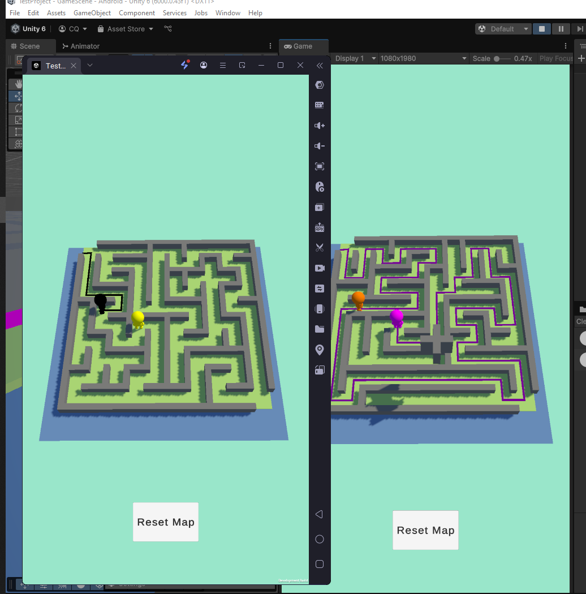
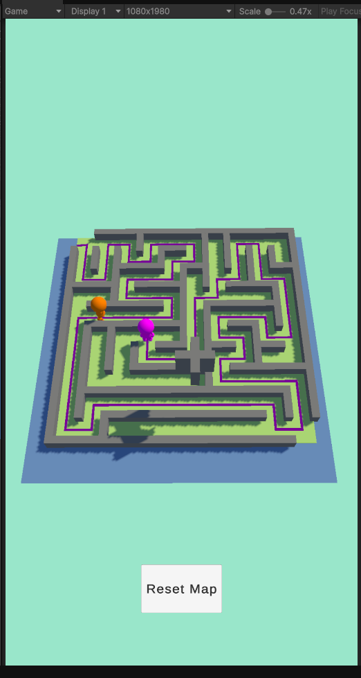

"# TestProject for brew" 
// Author : Trương Quang Chiến 

Maze Generation Algorithm

1. The maze in this project is generated using a Recursive Backtracker algorithm, a type of depth-first search (DFS) algorithm commonly used for procedural maze creation. The algorithm works as follows:

2. Start from a random cell and mark it as visited.

3. Randomly select one of the unvisited neighboring cells.

4. Remove the wall between the current cell and the chosen neighbor.

5. Move to the chosen neighbor and repeat steps 2–3.

6. If a cell has no unvisited neighbors, backtrack to the previous cell until a cell with unvisited neighbors is found.

7. Continue this process until all cells have been visited.

Player Pathfinding Algorithm

- For player navigation, the project uses Breadth-First Search (BFS) to find the shortest path from the player’s current position to a target cell within the maze. The BFS algorithm works as follows:

- gender Line and player transfrom with line

- This BFS-based pathfinding ensures that the player always follows the shortest possible route through the maze. The computed path is represented as a sequence of grid coordinates or world positions, which the player character can then follow.

Photon Integration

1. Maze Generation: Only the Master Client generates the maze. The cell positions and wall data are serialized (e.g., converting enum directions to bytes) and sent to other clients using RPCs with buffered events, ensuring that even clients who join later receive the maze.

2. Pathfinding: Each client can independently compute BFS for its player character based on the synchronized maze structure. This avoids unnecessary network traffic while allowing smooth, client-side movement.

//ScreenShort

